# Tamar

IBS-friendly recipe recommendation project for a university recommender systems course.


Tamar helps users discover recipes that match both taste preferences and IBS-related comfort patterns. The app combines collaborative filtering, diary-based symptom tracking, ingredient-risk modeling, strict food-safety filters, cookbook organization, and Gemini-assisted chat and food logging into one recipe recommendation workflow.

To try Tamar without configuring local services or API keys, use the hosted online version shared by the project team. Its Gemini and database credentials are configured securely on the server. Running the full app locally is intended for development and requires your own Supabase project and Gemini API key.

## Documentation

You can find the course-facing documentation in the following files:

- [Installation Guide](install.md)
- [Project Summary](summary.md)
- [Modules Description](modules.md)

The deeper engineering documentation remains under [docs/](docs/), especially the recommender design, local setup, QA, and recipe image plans.

## About

This project is developed for the *Recommender Systems Workshop* at Tel Aviv University.
More information can be found on the [Workshop Website](https://courses.cs.tau.ac.il/recsys/).

## Free-Tier Availability

This project uses free-tier hosting. Supabase may pause inactive free projects, and Render may spin down or run free services more slowly. As a result, the app may be temporarily unavailable or the first request after a period of inactivity may take longer than usual. If this happens or the app does not load, please contact us using one of the email addresses below.

## Authors

- Yael Kelman - yaelsagi@mail.tau.ac.il
- Ram Kedem - ramkedem@mail.tau.ac.il
- Itai Mor - itaim1@mail.tau.ac.il
- Yehonatan Barel - yehonatanb3@mail.tau.ac.il

## Screenshots

| Account and onboarding | Food logging and cookbook |
| --- | --- |
| 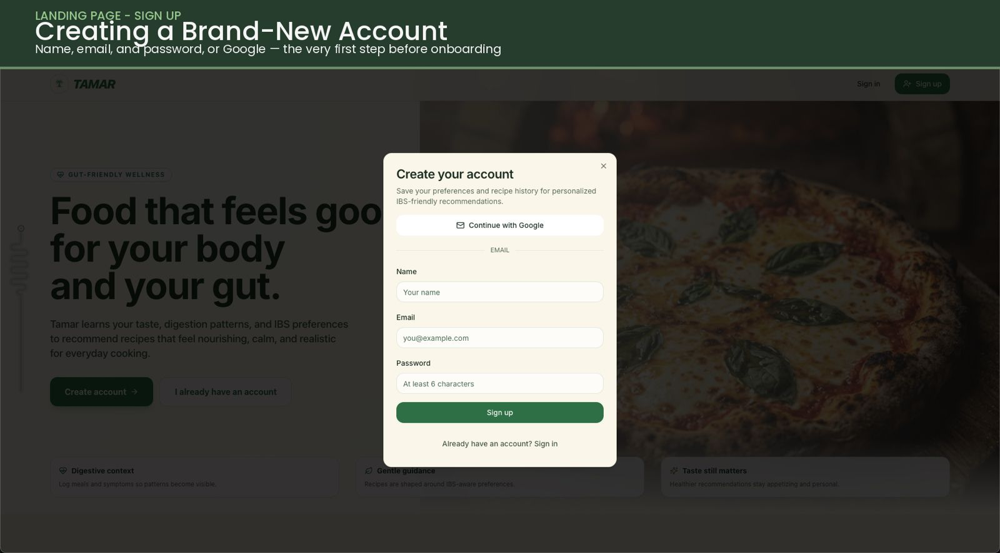 | 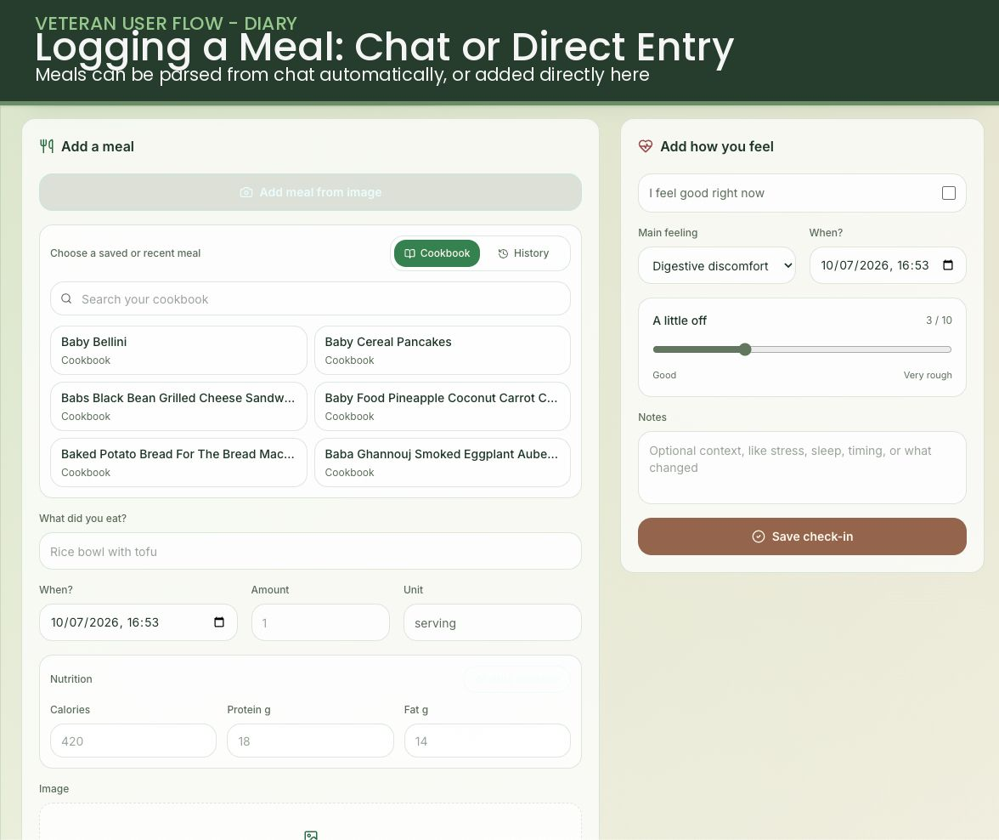 |
| 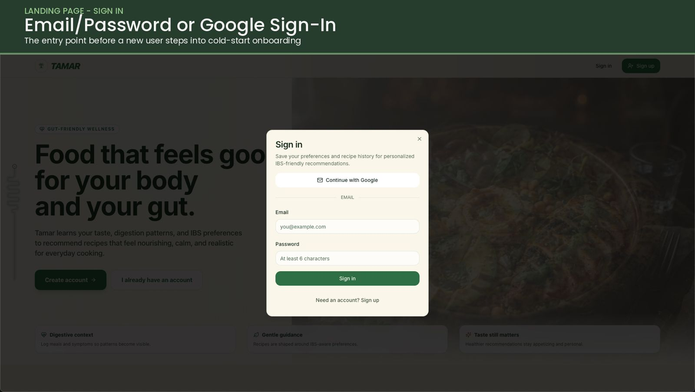 | 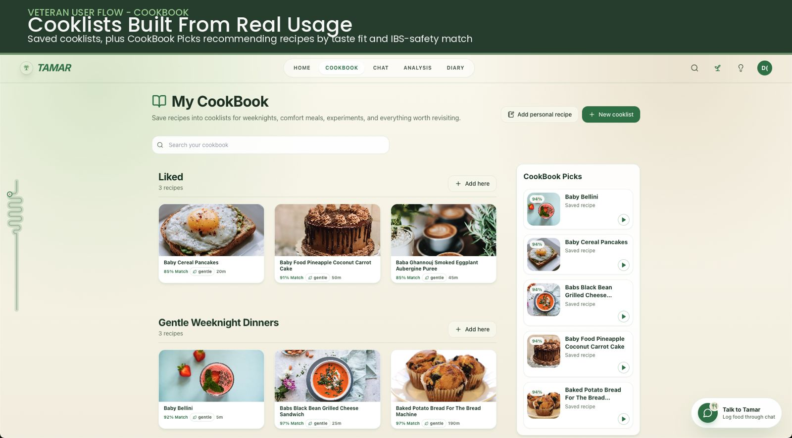 |
| 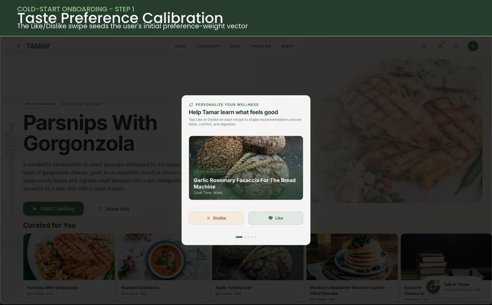 | 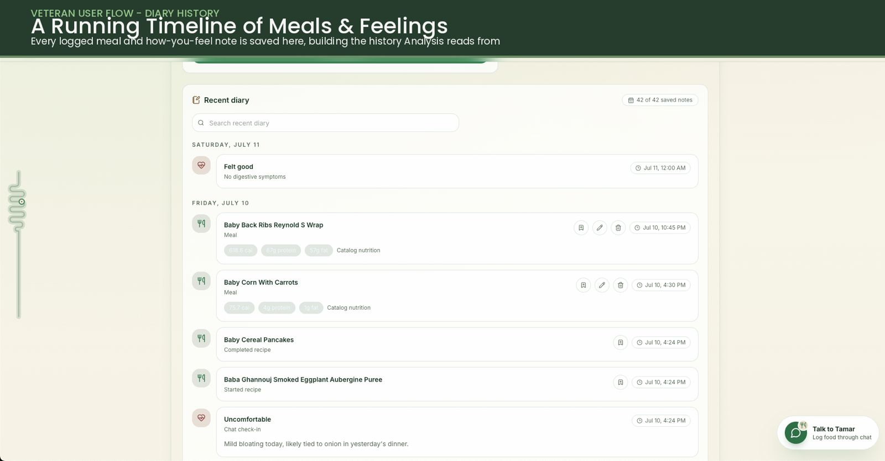 |
| 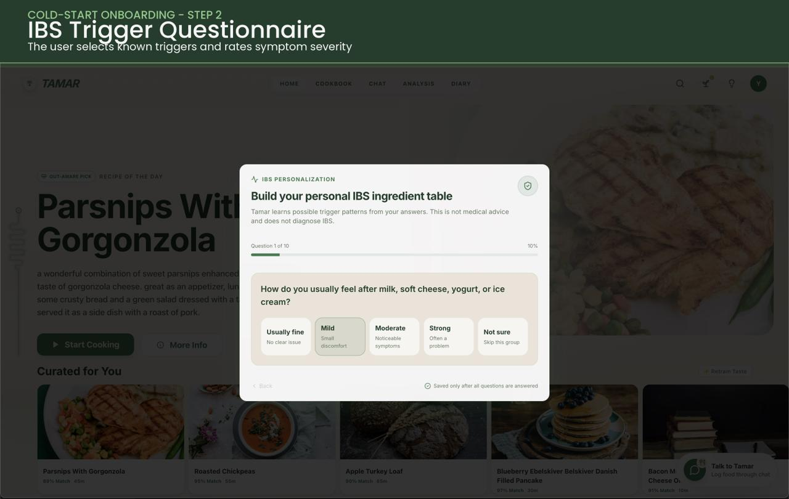 | 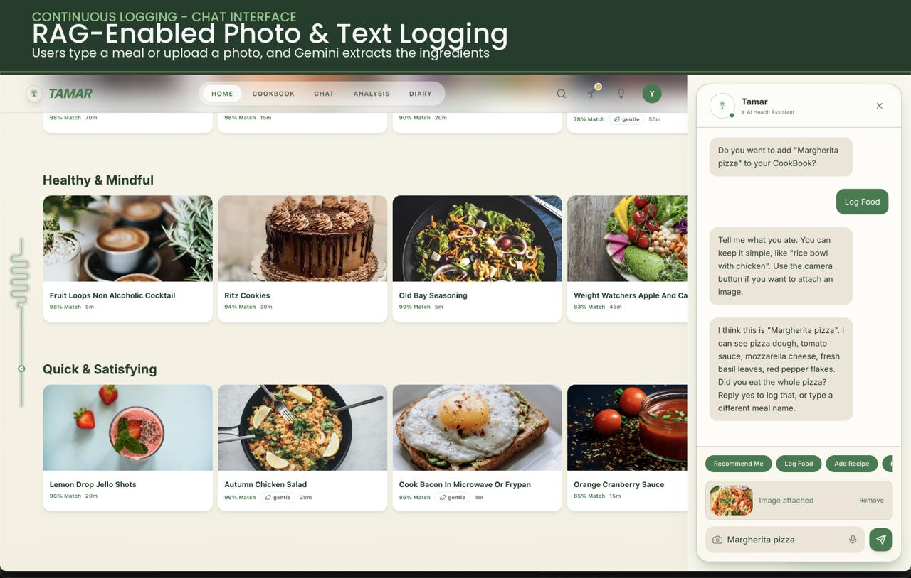 |

| Analysis, premium, and recommendation views |
| --- |
| 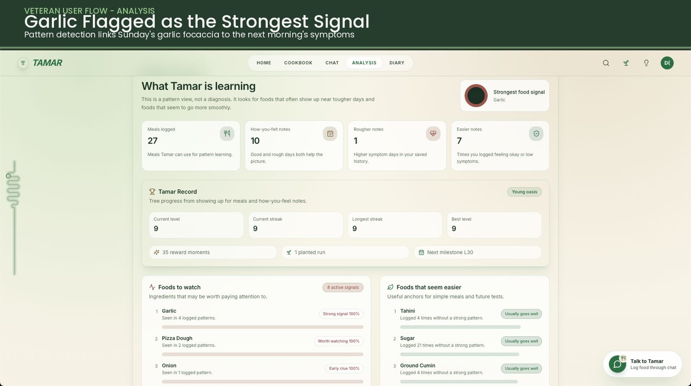 |
| 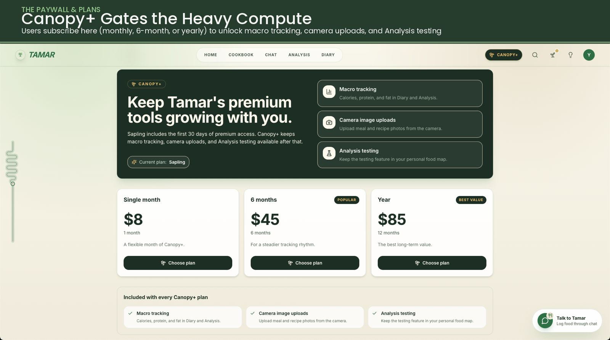 |
| 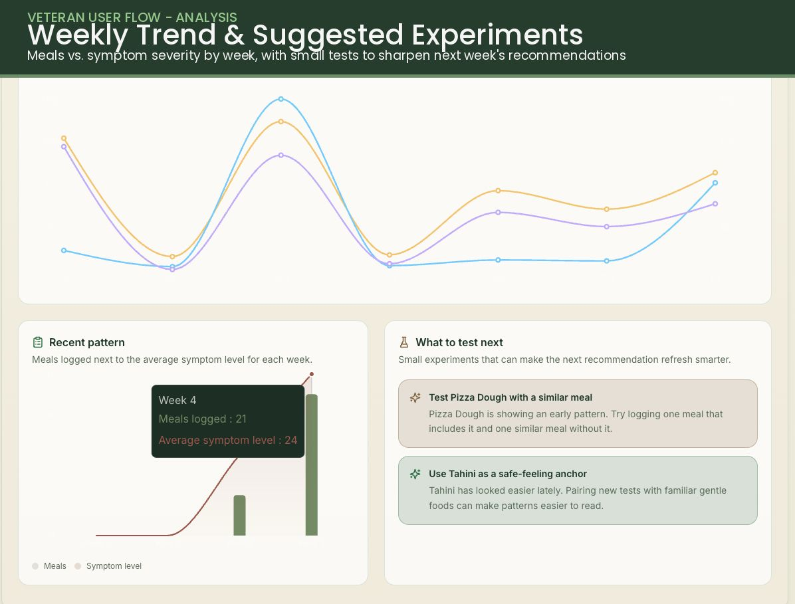 |
| 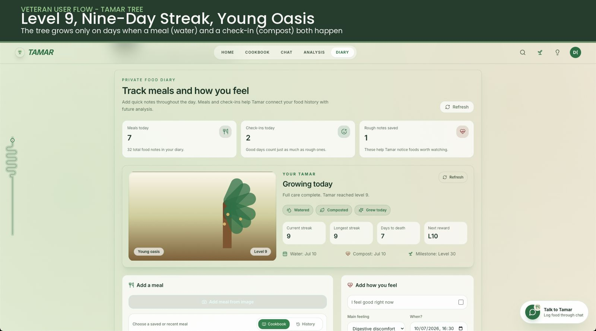 |

## Repo Structure

Use this section as the starting map for the repository. For deeper module behavior, follow the linked docs instead of guessing from filenames alone.

### Main Documentation

| Area | Source |
| --- | --- |
| Course-facing installation guide | [install.md](install.md) |
| Course-facing project summary | [summary.md](summary.md) |
| Course-facing module descriptions | [modules.md](modules.md) |
| Recommender architecture, risk scoring, model roles, and algorithm design | [docs/IBS_Recommender_Online_LightFM_Design.md](docs/IBS_Recommender_Online_LightFM_Design.md) |
| IBS product relevance plan and implementation notes | [docs/ibs/IBS_RELEVANCE_PLAN.md](docs/ibs/IBS_RELEVANCE_PLAN.md) |
| Local setup for the website plus Python recommender service | [docs/LOCAL_SETUP_WITH_RECOMMENDER.md](docs/LOCAL_SETUP_WITH_RECOMMENDER.md) |
| Website QA plan for manual, phone, freemium, and Tamar tree testing | [docs/QA_PLAN.md](docs/QA_PLAN.md) |
| Recipe image strategy, image cache, category fallbacks, and Pexels behavior | [docs/RECIPE_IMAGES_PLAN.md](docs/RECIPE_IMAGES_PLAN.md) |
| Contribution and design-alignment rules | [CONTRIBUTING.md](CONTRIBUTING.md) |
| Project purpose and AI collaboration context | [docs/AI_CONTEXT.md](docs/AI_CONTEXT.md) |
| Google/Gemini API key setup for AI features | [docs/create_api_key.md](docs/create_api_key.md) |
| Earlier recommender brainstorming summary and supporting charts | [docs/brainstorms/IBS_Recommender_Brainstorm_Summary.md](docs/brainstorms/IBS_Recommender_Brainstorm_Summary.md) |

### Top-Level Folders

| Path | Purpose |
| --- | --- |
| `src/` | React/Vite frontend app. Contains pages, components, client-side Supabase helpers, recipe display logic, and UI state. |
| `api/` | Serverless-style TypeScript API handlers used by deployment and mirrored locally by Vite middleware where needed. |
| `RecommenderSys/` | Python recommender system, data seeding, model training, fast recommendation refresh, and recommender service. |
| `supabase/` | Versioned database migrations and a lightweight schema snapshot for app data, recommendation and safety flows, user uploads, and model artifact storage. |
| `docs/` | Human-readable design, setup, image, and project context documentation. |
| `images/` | Course submission logo and application screenshots used by this README. |
| `public/` | Static browser assets served directly by Vite. |
| `.agents/skills/` | Project-local Codex skills that tell AI agents how to stay aligned with Tamar-specific design and database expectations. |
| `.github/` | GitHub workflow and pull request metadata. |
| `dist/` | Generated frontend build output. Do not edit by hand. |
| `node_modules/` | Installed frontend dependencies. Do not edit by hand. |

### Frontend App

| Path | Purpose |
| --- | --- |
| `src/App.tsx` | Top-level routing. Connects public/auth-gated routes to pages. |
| `src/main.tsx` | React entrypoint. Mounts the app. |
| `src/pages/Landing.tsx` | Public landing page. |
| `src/pages/Home.tsx` | Main recipe homepage with hero, recommendation rows, onboarding/taste feedback, saved-state actions, and image-fill queueing. |
| `src/pages/RecipeDetail.tsx` | Recipe detail view with ingredients, steps, and interaction logging. |
| `src/pages/CookBook.tsx` | Cooklist-based cookbook view for saved recipes. |
| `src/pages/Pricing.tsx` | Authenticated Canopy+ pricing page with monthly, six-month, and yearly plan options. Checkout is currently marked coming soon. |
| `src/pages/Index.tsx` | Shell for secondary tools/screens such as chat, diary, and analysis. |
| `src/components/AuthProvider.tsx` | Supabase auth session provider and profile synchronization. |
| `src/components/AuthDialog.tsx` | Sign-in/sign-up UI. |
| `src/components/Navbar.tsx` | Main navigation and authenticated user controls. |
| `src/components/CanopyUpgradeDialog.tsx` | Shared Canopy+ upsell dialog and inline locked-feature panel for freemium gates. |
| `src/components/ForbiddenFoodsPanel.tsx` | Shared UI for viewing and managing the user's strict food restrictions. |
| `src/components/TamarTreePanel.tsx` | Diary tree-care panel for the Tamar habit loop, with water/compost/growth/death/replant UI. |
| `src/components/TamarTreeBadge.tsx` | Compact global Tamar tree status badge used from the navbar. |
| `src/components/ImageWithSkeleton.tsx` | Shared image rendering with loading skeleton/fallback handling. |
| `src/components/*Screen.tsx` | Tool/demo screens used inside the app shell. |
| `src/components/ui/` | shadcn/Radix-style reusable UI primitives. Usually treat as design-system components. |
| `src/assets/` | Bundled local images used by static/demo UI sections. |

### Frontend Data And Client Logic

| Path | Purpose |
| --- | --- |
| `src/lib/supabase.ts` | Browser Supabase client setup from `VITE_SUPABASE_URL` and `VITE_SUPABASE_PUBLISHABLE_KEY`. |
| `src/lib/recipes.ts` | Recipe fetching, mapping, deterministic match display, image fallback/category logic, and recipe image selection. See [docs/RECIPE_IMAGES_PLAN.md](docs/RECIPE_IMAGES_PLAN.md). |
| `src/lib/recipeInteractions.ts` | Reads/writes recipe interactions, saved recipes, onboarding feedback counts, and cooklist membership helpers. |
| `src/lib/diary.ts` | Reads and writes Diary meals/check-ins, expands chat check-in foods, and includes started/completed recipe activity. |
| `src/lib/chatFoodLogging.ts` | Conservatively validates free-text Chat food logs and recognizes explicit guided-flow cancellation before Diary writes. |
| `src/lib/tamarTree.ts` | Derives and persists Tamar tree care state, streaks, cosmetic reward events, death/replant records, and tree nudges from existing meal/check-in logs. |
| `src/lib/foodImageAnalysis.ts` | Client helper for authenticated Gemini food-photo analysis used by Chat, Diary, and CookBook draft flows before the user confirms saved content. |
| `src/lib/chatHistory.ts` | Provides recent per-account chat continuity in the browser. |
| `src/lib/recommendationSafety.ts` | Shared helpers for managing and applying hard food restrictions. |
| `src/lib/chatRestrictions.ts` | Connects explicit chat allergy statements to the shared restriction flow. |
| `src/lib/freemium.ts` | Client-side Canopy+/Sapling plan helpers, trial countdown calculations, and throttled reminder storage. |
| `src/lib/coldStart.ts` | Legacy/static cold-start recipe vector definitions and helper behavior. |
| `src/lib/utils.ts` | Shared frontend utility helpers. |

### API Layer

| Path | Purpose |
| --- | --- |
| `api/refresh-recommendations.ts` | Authenticated bridge from the frontend to the Python recommender service. |
| `api/meal-log.ts` | Authenticated bridge for Diary meal logging; calls the recommender service when configured and otherwise stores the meal row. |
| `api/health-report.ts` | Authenticated bridge for Diary symptom/check-in logging; calls the recommender service when configured and otherwise stores the check-in row. |
| `api/analyze-food-image.ts` | Authenticated Gemini bridge for user-uploaded food photos. Validates the upload belongs to the signed-in user and returns conservative meal/recipe title and ingredient suggestions for confirmation. |
| `api/estimate-meal-nutrition.ts` | Authenticated nutrition estimate bridge for Diary meal logs. Uses catalog recipe nutrition when available and Gemini estimates for free-text/photo-assisted meals. |
| `api/fill-recipe-images.ts` | Authenticated image-cache filler. Searches Pexels, writes `recipe_images`, and avoids repeated cached images where possible. See [docs/RECIPE_IMAGES_PLAN.md](docs/RECIPE_IMAGES_PLAN.md). |
| `api/generate.ts` | AI generation endpoint with signed-in structured chat context retrieval. See [docs/create_api_key.md](docs/create_api_key.md) for key setup. |
| `api/chat-rag-context.ts` | Shared helper that retrieves bounded Supabase context for general chat RAG without changing recommender ranking. |
| `vite.config.ts` | Vite config plus local dev middleware that mirrors key API routes for local testing. |

### Recommender System

| Path | Purpose |
| --- | --- |
| `RecommenderSys/lightfm_features.py` | Bounded LightFM user/item feature construction from real recipe metadata, interaction-derived taste, restrictions, and ingredient-risk signals. |
| `RecommenderSys/recommend_batch.py` | Batch hybrid LightFM training with user/item features, learned user representations, generation-safe candidate/artifact publication, and matrix-factorization fallback. |
| `RecommenderSys/recommend_fast.py` | Candidate-first per-user refresh that combines the learned batch user representation with evidence-weighted post-training interactions, then applies hard filters, ingredient risk, symptom risk, and final reranking. |
| `RecommenderSys/risk_scoring.py` | Shared fail-safe restriction filtering, real-recipe XGBoost feature construction, IBS/personal ingredient risk, symptom-model scoring, and final reranking helpers. |
| `RecommenderSys/health_events.py` | Meal-log, health-report, exposure, restriction, recipe-ingredient sync, and personalized ingredient-risk update helpers. |
| `RecommenderSys/train_symptom_model.py` | Leakage-aware offline symptom-risk training from catalog-backed meals, explicit symptom/no-symptom outcomes, real recipe metadata, and causal prior context. Uses XGBoost when available. |
| `RecommenderSys/recommender_service.py` | FastAPI service used by the frontend/API bridge for online refreshes plus meal, health, and restriction endpoints. |
| `RecommenderSys/recommender_common.py` | Shared recommender constants, category logic, and utilities. |
| `RecommenderSys/seed_database.py` | Seeds Supabase with Food.com data or fallback mock recipe/interactions. |
| `RecommenderSys/cold_start_active_learning.py` | Experimental/legacy cold-start active-learning module. |
| `RecommenderSys/src/` | Baseline recommender implementations and evaluation helpers used for coursework/reference. |
| `RecommenderSys/IBS_models/fodmap_mapping.csv` | IBS/FODMAP-related ingredient mapping data. |
| `RecommenderSys/requirements.txt` | Python dependencies for recommender training/service workflows. |

The recommender architecture source of truth is [docs/IBS_Recommender_Online_LightFM_Design.md](docs/IBS_Recommender_Online_LightFM_Design.md). Before changing algorithms, scoring, risk logic, interaction weights, or recommender database shape, read that document.

### Supabase Data Model

| Path | Purpose |
| --- | --- |
| `supabase/migrations/` | Source of truth for the full database. Apply the timestamped migrations in filename order to create recipe, interaction, restriction, diary, recommendation, cookbook, Tamar tree, Storage, and supporting app data. |
| `supabase/schema.sql` | Lightweight bootstrap snapshot for a subset of core tables. It does not replace the migration sequence for the current app. |

Use the project Supabase skill and the design document before changing schema, RLS, recommendation storage, or API-facing tables.

### Where To Start Before Editing

| Task type | Start here |
| --- | --- |
| Run the app locally | [docs/LOCAL_SETUP_WITH_RECOMMENDER.md](docs/LOCAL_SETUP_WITH_RECOMMENDER.md) |
| Change recipe images | [docs/RECIPE_IMAGES_PLAN.md](docs/RECIPE_IMAGES_PLAN.md), then `src/lib/recipes.ts` and `api/fill-recipe-images.ts` |
| Change recommendation logic or risk scoring | [docs/IBS_Recommender_Online_LightFM_Design.md](docs/IBS_Recommender_Online_LightFM_Design.md), then `RecommenderSys/` and related API/Supabase files |
| Make the app more IBS-specific | [docs/ibs/IBS_RELEVANCE_PLAN.md](docs/ibs/IBS_RELEVANCE_PLAN.md), then the recommender design doc if scoring or schema changes |
| Change saved recipes or interaction behavior | `src/lib/recipeInteractions.ts`, `src/pages/Home.tsx`, `src/pages/RecipeDetail.tsx`, and the design doc if recommendation signals change |
| Change auth behavior | `src/components/AuthProvider.tsx`, `src/components/AuthDialog.tsx`, `src/lib/supabase.ts`, and Supabase policies if data access changes |
| Change UI pages/components | `src/pages/`, `src/components/`, and `src/components/ui/` |
| Change deployment/local dev API behavior | `api/`, `vite.config.ts`, and [docs/LOCAL_SETUP_WITH_RECOMMENDER.md](docs/LOCAL_SETUP_WITH_RECOMMENDER.md) |

## Tamar Tree Habit Loop

Tamar includes a motivational date-tree companion tied to the existing Diary flow. The full tree lives at the top of Diary, a compact tree badge lives in the navbar, and Analysis shows a read-only Tamar Record.

- Meal logs water the tree.
- How-you-feel check-ins compost the tree.
- A local calendar day with both water and compost grows the tree at most once.
- Food-only or feeling-only days keep the tree alive but do not increase level.
- Seven consecutive local dates with no water and no compost kill the current tree run.
- Replanting starts a new sapling while preserving best level, best streak, reward history, and past runs.
- Rewards are deterministic cosmetic moments: early levels change frequently, later levels unlock small details every 2 levels, medium moments every 5 levels, larger world changes every 10 levels, and big zones at levels 100, 200, and 300.

Tree state is an engagement overlay only. It reads meal/check-in activity and writes `user_tamar_tree_runs` plus `user_tamar_tree_reward_events`, but it must not affect recommendation ranking, health-risk scoring, ingredient attribution, or medical/pattern conclusions.

## Authentication and Database Setup

This app uses Supabase for authentication, application data, recommendation state, and private Storage.

1. Create a Supabase project.
2. For the full current app, run the migrations in `supabase/migrations` in filename order. The complete local sequence is listed in [docs/LOCAL_SETUP_WITH_RECOMMENDER.md](docs/LOCAL_SETUP_WITH_RECOMMENDER.md).
   `supabase/schema.sql` is only a lightweight bootstrap snapshot and is not enough for current Diary, Analysis, nutrition, Tamar tree, image-upload, or recommender-service flows.
3. Copy `.env.example` to `.env.local`.
4. Fill in:

```bash
VITE_SUPABASE_URL=...
VITE_SUPABASE_PUBLISHABLE_KEY=...
```

For AI chat, food-photo analysis, image filling, and recommender refreshes, also fill the server-side variables documented in `.env.example` and [docs/LOCAL_SETUP_WITH_RECOMMENDER.md](docs/LOCAL_SETUP_WITH_RECOMMENDER.md).

5. In Supabase Authentication, enable email/password, Google, and Facebook providers.
6. Add your local URL, usually `http://127.0.0.1:8080` or `http://localhost:8080`, to the allowed redirect URLs.

Recipe interactions are stored in `recipe_interactions` so they can later become recommendation signals for the "Curated for You" section. Cookbook organization lives in `cooklists` and `cooklist_recipes`; adding a catalog recipe to the default Liked cooklist also records a `saved` interaction. Personal recipes can be stored in cooklists without creating catalog recommendation events. CookBook sidebar recommendations are stored separately on `user_recommendations` and are limited to recipes already in the user's cooklists.

Strict allergies, sensitivities, forbidden ingredients, and diet restrictions are user-owned safety constraints applied across recommendation surfaces. Recent chat history is kept per account in the same browser so it can survive a refresh without becoming recommender evidence.

The freemium UI treats signed-in users as `Sapling` by default and gives them 30 days of access to Canopy+ features based on the Supabase auth user's `created_at` timestamp. Canopy+ status is read from `app_metadata` rather than user-editable metadata; supported flags include `canopy_plus`, `tamar_canopy`, or plan-like values such as `canopy_plus` on `tamar_plan`, `plan`, or `subscription_tier`. Current Canopy+ checkout buttons intentionally show a coming-soon payment message.

## Design Alignment

The revised implementation design is the source of truth for recommender architecture and risk-scoring behavior:

[docs/IBS_Recommender_Online_LightFM_Design.md](docs/IBS_Recommender_Online_LightFM_Design.md)

Any change that affects recommender logic, model training, recommendation APIs, risk scoring, meal/symptom logging, or related database schema must either follow that document or update it in the same change. See [CONTRIBUTING.md](CONTRIBUTING.md).

Agent/LLM contributors should also use the project skill at [.agents/skills/tamar-design-alignment/SKILL.md](.agents/skills/tamar-design-alignment/SKILL.md) before changing recommender-related behavior.
