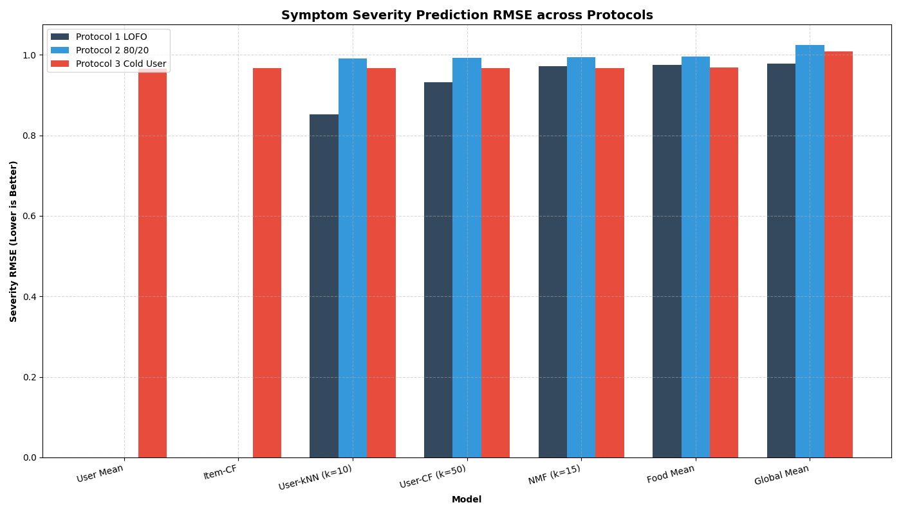
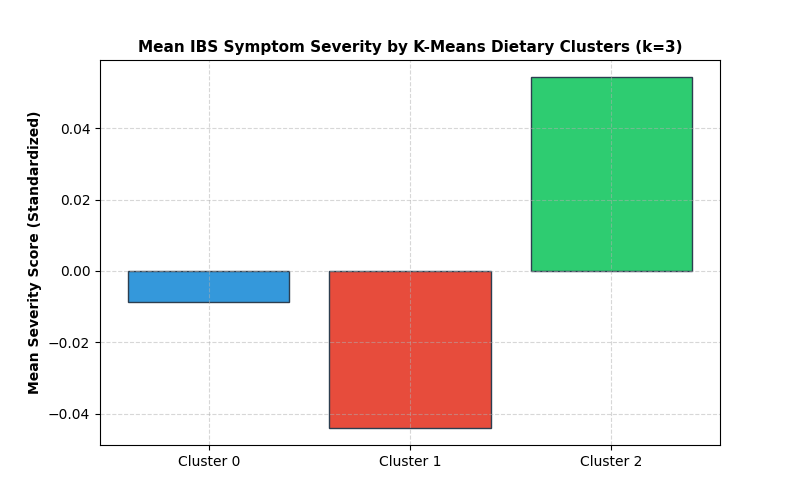
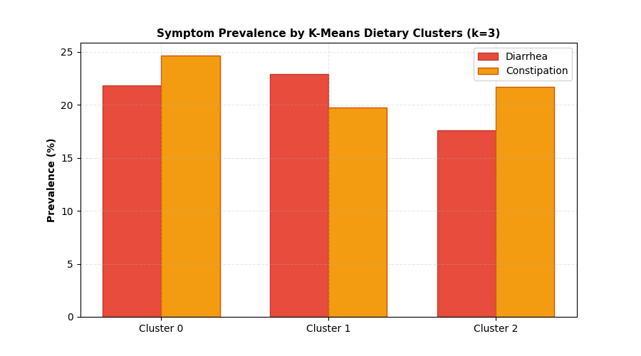
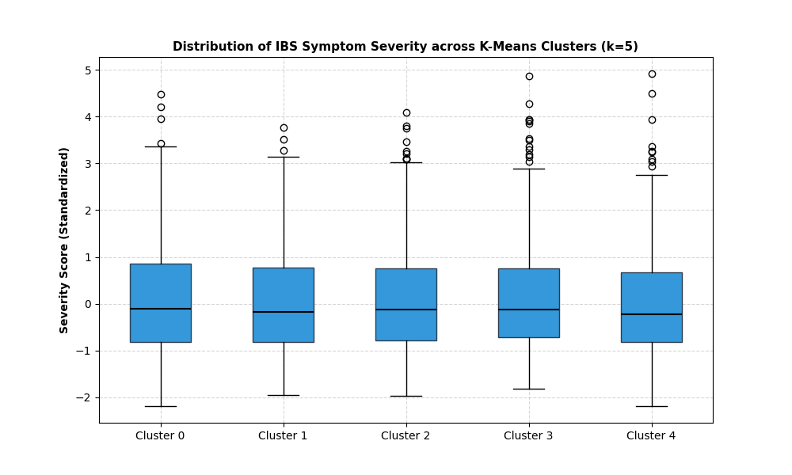

# IBS-Aware Food Recommendation System — Design Summary

This document details the design, evolution, and implementation decisions for the Tamar Food Recommendation System, which balances user culinary preferences with health risk management for individuals with Irritable Bowel Syndrome (IBS).

---

## 1. Given Input and Expected Output

### Given Input
* **Implicit Interaction Data**:
  * User interactions (such as recipe views, completions, likes, and dismissals) logged in the online system via [IBS_Recommender_Online_LightFM_Design.md](file:///c:/Users/itai5/Desktop/CS/3rd/Tamar/Tamar/docs/IBS_Recommender_Online_LightFM_Design.md).
* **Clinical Priors & Dietary Constraints**:
  * Onboarding inputs (allergies, sub-types, strict rules) and ingredient-level classifications mapping raw foods to FODMAP categories (Fructans, GOS, Lactose, Excess Fructose, Polyols) stored in [fodmap_mapping.csv](file:///c:/Users/itai5/Desktop/CS/3rd/Tamar/Tamar/RecommenderSys/IBS_models/fodmap_mapping.csv).
* **Personalized Active Logs**:
  * Daily user meal consumption entries (`meal_logs`) and clinical symptom reports (`health_reports`) representing individual user histories.

### Expected Output
* **Safety-Constraint Reranked Recommendations**:
  * A ranked list of recipe suggestions that balance user enjoyment with safety, computed using:
    $$\text{final\_score} = \text{preference\_score} - \lambda \times \text{combined\_risk\_score}$$
* **Onboarding Active Learning Selection**:
  * Representative seed recipe items for preference gathering during cold-start onboarding, determined by K-Medoids active learning in [cold_start_active_learning.py](file:///c:/Users/itai5/Desktop/CS/3rd/Tamar/Tamar/RecommenderSys/cold_start_active_learning.py).
* **Personalized Ingredient-Level Risk Profiles**:
  * User-specific Bayesian estimate of risk and confidence for every ingredient, categorizing ingredients dynamically as `known_bad`, `suspected_bad`, `unknown`, `suspected_good`, or `known_good`.

---

## 2. Evolution of Requirements (Changes along the way)

1. **From NMF CF to Hybrid LightFM**:
   * *Initial*: proposed using Non-Negative Matrix Factorization (NMF) on population-level eating survey data (in [train_nmf.py](file:///c:/Users/itai5/Desktop/CS/3rd/Tamar/Tamar/RecommenderSys/train_nmf.py)) to model user preferences.
   * *Current*: A hybrid **LightFM** model combining in-app implicit interactions, recipe attributes (ingredients/macros), and user features.
2. **Hard Filters for Allergies**:
   * *Initial*: Treat allergies as high-risk penalties in the scoring function.
   * *Current*: Move allergies to **pre-scoring hard filters** to completely exclude any recipe containing a forbidden allergen before computing recommendation ranks.
3. **Limiting similarity propagation boundaries**:
   * *Initial*: Propagate risk globally across all similar ingredients transitively.
   * *Current*: Enforced strict boundary rules—propagation is limited to **one-hop neighbors** and the top 10-20 most similar items with a similarity threshold of $\ge 0.30$ to prevent risk scores from diluting.
4. **Digestion-Window Blame Allocation (Temporal Attribution)**:
   * *Initial*: Assign full blame to the single meal consumed immediately before symptoms.
   * *Current*: Transitioned from immediate blame to a **48-hour temporal window** with exponential decay to fractionally attribute symptoms across recent meals.
5. **Symptom Prediction Pivot (The Breakthrough Conclusion)**:
   * *Initial*: Predict symptom outcomes for a specific user-food pair using NMF collaborative filtering.
   * *Current*: Our latest experiments (symptom prediction model evaluation in [diet_symptom_analysis.py](file:///c:/Users/itai5/Desktop/CS/3rd/Tamar/Tamar/RecommenderSys/diet_symptom_analysis.py), robustness audit in [diet_symptom_robustness.py](file:///c:/Users/itai5/Desktop/CS/3rd/Tamar/Tamar/RecommenderSys/diet_symptom_robustness.py), and dietary clustering in [ibs_phenotype_clustering.py](file:///c:/Users/itai5/Desktop/CS/3rd/Tamar/Tamar/RecommenderSys/ibs_phenotype_clustering.py)) proved that **this dataset cannot predict IBS for new users**. Pairwise dietary similarity does not map to symptom similarity ($r < 0.02$, not significant), and unsupervised dietary clusters do not map to clinical IBS phenotypes (dietary clusters explain $<1\%$ of symptom variance). As a result, we pivoted from group-level collaborative symptom prediction to **personalized Bayesian symptom attribution** combined with **ingredient-level clinical priors** (represented by [fodmap_mapping.csv](file:///c:/Users/itai5/Desktop/CS/3rd/Tamar/Tamar/RecommenderSys/IBS_models/fodmap_mapping.csv)).
   * > [!WARNING]
   * > **Population Dataset Rejected & Dropped**: The tested population survey dataset failed all predictive validation protocols. It has been **completely excluded** from the codebase and will **not be in use** in the production recommender system. All NMF latent factors, user embeddings, and risk indexes derived from it have been deleted from the repository.

---

## 3. Development Process & Iterations

1. **Iteration 1: Collaborative Filtering & NMF Risk Prediction**
   * *What was attempted*: Fit NMF models on aggregated food intake survey data to extract dietary factors and correlate them with bowel symptoms using logistic regression (implemented in [train_nmf.py](file:///c:/Users/itai5/Desktop/CS/3rd/Tamar/Tamar/RecommenderSys/train_nmf.py) and [run_phase2.py](file:///c:/Users/itai5/Desktop/CS/3rd/Tamar/Tamar/RecommenderSys/run_phase2.py)).
   * *What did not work*: The model appeared to perform well in warm-user evaluation, but this was a design artifact of the survey source recording symptoms once per user (constant vector). For cold/unseen users, the model collapsed back to the population average (RMSE $\approx 0.966$), showing **zero predictive capability**.
   * *Plot (Model Evaluation Comparison)*:
     
2. **Iteration 2: Robustness Audit of Dietary Feature Spaces**
   * *What was attempted*: Evaluated 7 alternative dietary representations (raw grams, percentages, binary consumption, food groups, TF-IDF, FODMAP exposure) across classifiers (Logistic Regression, Random Forest, Gradient Boosting) in [diet_symptom_robustness.py](file:///c:/Users/itai5/Desktop/CS/3rd/Tamar/Tamar/RecommenderSys/diet_symptom_robustness.py).
   * *What did not work*: No model could beat the majority baseline. Diarrhea/constipation ROC-AUC remained at 0.50–0.56 (equivalent to random guessing), and severity score $R^2$ collapsed to $\le 0$.
3. **Iteration 3: Unsupervised Dietary Clustering & Phenotypic Mapping**
   * *What was attempted*: Clustered users based on dietary profiles using K-Means, NMF, and Hierarchical Clustering for $k \in \{2, 3, 5, 8, 10\}$ (optimized using TruncatedSVD and sparse matrices in [ibs_phenotype_clustering.py](file:///c:/Users/itai5/Desktop/CS/3rd/Tamar/Tamar/RecommenderSys/ibs_phenotype_clustering.py)).
   * *What did not work*: Dietary clusters were highly distinct, but their symptom distributions were virtually identical. The maximum Eta-squared was **0.0100**, proving that dietary clusters explain **at most 1%** of variance in symptoms.
   * *Plot (Symptom Prevalence & Severity Boxplot)*:
     ````carousel
     
     <!-- slide -->
     
     <!-- slide -->
     
     ````
4. **Key Insight & Final Justification**:
   * The 24-48 hour dietary recall in surveys is decoupled from chronic IBS symptoms. Consequently, collaborative filtering and group-based clustering models are useless for symptom prediction. We justified **discarding the NMF and CF symptom predictors** from the system and keeping only [fodmap_mapping.csv](file:///c:/Users/itai5/Desktop/CS/3rd/Tamar/Tamar/RecommenderSys/IBS_models/fodmap_mapping.csv) as a clinical prior. The recommendation engine now relies on personalized Bayesian updates from active meal-symptom logging to resolve individual user sensitivity.

---

## 4. Core Engineering Dilemmas

* **Safety vs. User Engagement**: Recommending strictly safe foods (e.g., white rice and chicken) guarantees low risk but leads to high abandonment due to monotony. Conversely, recommending trigger foods leads to physical discomfort.
  * *Resolution*: Weighted subtraction using a tunable penalty factor ($\lambda$). Early users start with high $\lambda$ (prioritizing safety), which is relaxed as ingredient-level confidence increases.
* **Real-Time API Latency vs. Model Complexity**: Running high-dimensional matrix similarity propagation, Bayesian updates, and XGBoost contextual predictions online for tens of thousands of recipes violates typical web request latency budgets.
  * *Resolution*: Two-stage pipeline. The heavy model training and candidate generation (LightFM) are run offline to precompute a pool of the top 300-500 candidate recipes per user. The live API (managed by [recommend_fast.py](file:///c:/Users/itai5/Desktop/CS/3rd/Tamar/Tamar/RecommenderSys/recommend_fast.py)) only filters and reranks this precomputed subset.
* **Cold-Start Sensitivity Inference vs. Long-Term Tracking**: How to protect users from symptoms during onboarding? Since population-level collaborative filtering fails to predict individual sensitivity, we cannot infer a user's sensitivities from dietary neighbors.
  * *Resolution*: Utilizing strict clinical priors (excluding high-FODMAP foods initially based on IBS subtype) and transitioning to personalized learning via active meal logging.

---

## 5. Key Assumptions Made

* **digestion-Window Limitation**: It is assumed that symptoms caused by food manifest within a **48-hour window** post-ingestion.
* **No Shared Sensitivities via Dietary Similarity (Proven False)**: The initial assumption that users who eat similarly share similar food sensitivities was proven **false** by statistical analysis (Pearson correlation $r \approx 0.014$, not significant).
* **Independence of Ingredient Sensitivity**: For Bayesian updating, ingredient trigger sensitivities are modeled as conditionally independent, allowing us to update ingredient risk scores separately based on multi-ingredient meal logs.
* **Linear Utility**: The mathematical utility of a food item to a sensitive user is assumed to be linear and can be represented by subtracting weighted risk from preference.

---

## 6. Architectural Decisions & Implementation Details

The system is split into scheduled offline tasks and lightweight, fast online API routes:

* **Two-Stage Recommendation Pipeline**:
  * *Stage 1 (Offline)*: Train LightFM preference models using implicit ratings and recipe features. Save the top candidate recipes per user to a fast cache.
  * *Stage 2 (Online - [recommend_fast.py](file:///c:/Users/itai5/Desktop/CS/3rd/Tamar/Tamar/RecommenderSys/recommend_fast.py))*: Fetch candidate recipes, apply hard allergen exclusions, execute personalized Bayesian risk updates, and rank using:
    $$\text{final\_score} = \text{preference\_score} - \lambda \times \text{combined\_risk\_score}$$
* **Personalized Bayesian Risk Updater**:
  * When a user logs a symptom (e.g. bloating) within 48 hours of eating a meal:
    $$P(\text{Trigger}_i | \text{Symptom}) = \frac{P(\text{Symptom} | \text{Trigger}_i) \cdot P(\text{Trigger}_i)}{P(\text{Symptom})}$$
  * Accumulates evidence fractionally across multiple logs to separate common ingredients (e.g. garlic) from safe variables (e.g. rice).
* **Clinical Prior Layer**:
  * Uses the rule-based FODMAP mappings in [fodmap_mapping.csv](file:///c:/Users/itai5/Desktop/CS/3rd/Tamar/Tamar/RecommenderSys/IBS_models/fodmap_mapping.csv) as default starting risk values for new users based on their onboarding IBS subtype (e.g., higher lactose risk for IBS-D).

---

## 7. Success Metrics

### Offline Model Metrics
* **Preference Models**: `NDCG@10` (Target: $>0.30$), `MAP@10`, and `Catalog Coverage`.
* **Symptom Risk Models**: RMSE and ROC-AUC of the binary symptom classifier (used to reject the population-level collaborative model when it failed to exceed the majority class baseline).

### Online Product Metrics
* **Clinical Success**: Rate of logged symptom reports per meal consumed (expected to decline over weeks of use).
* **User Engagement**: Click-Through Rate (CTR) on recommended recipes, and recipe completion rates.
* **Safe Variety Index**: Measure the diversity of safe ingredients suggested to ensure dietary satisfaction.

---

## 8. Best and Worst-Case Scenarios

* **Best-Case Scenario**: The user successfully onboards, and the active learning medoids select recipes they enjoy. The system excludes trigger ingredients through hard allergen filters. When minor symptoms are logged, the Bayesian updater rapidly isolates trigger ingredients (e.g., garlic, onion) while keeping safe foods accessible. The user enjoys a varied, symptom-free diet.
* **Worst-Case Scenario (Severe Trigger Exposure)**: A false negative prediction suggests a recipe containing an unidentified trigger food (or a database ingredient mapping fails), causing the user to experience severe physical distress.
* **Worst-Case Scenario (High False Positives)**: The system is overly conservative, flagging many safe ingredients as high-risk. The user is left with a monotonous selection of plain foods and deletes the app out of frustration.
* **Worst-Case Scenario (Latency Failure)**: Live risk propagation or XGBoost prediction loops block the main request thread, causing database connection pools to saturate and API requests to time out.

---

## 9. Future Directions & Improvements

* **Bayesian Linear Regression on Ingredients**: Transition from individual Bayesian probability updates to a user-specific Bayesian regression model to estimate covariate interactions between ingredients.
* **Integration of Microbiome Data**: Incorporate fecal microbiome sequencing data (if available) as supplementary clinical priors to improve the initial sensitivity confidence values during onboarding.
* **Temporal Sequence Modeling**: Implement recurrent neural networks (RNNs) or attention-based models to capture the sequence and combination of foods consumed, allowing for complex multi-day symptom triggers.
* **Optimized SQL-Side Filtering**: Offload allergen and hard clinical prior filtering directly to the database via PostgreSQL indexing to further reduce online API latency.
